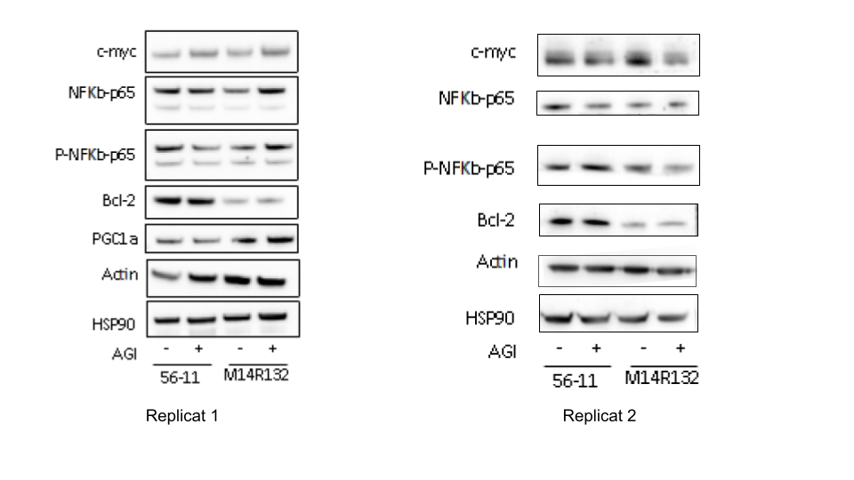

```{r, include=F, echo=F}
library(ggplot2)
library(dplyr)

Diff_facs_analysis_replicat_1 <- read.csv("Data/Replicat 1/Diff_AGI.csv")
Rhod2_facs_analysis_replicat_1 <- read.csv("Data/Replicat 1/Rhod2_AGI.csv")
PpIX_facs_analysis_replicat_1 <- read.csv("Data/Replicat 1/PpIX_AGI_ALA_Basal.csv")
Scenith_analysis_replicat_1 <- read.csv("Data/Replicat 1/Scenith.csv")


Replicat2 <- read.csv("Data/Replicat 2/2021 12 14 - Rhod2 - M14R132, 56-11 AGI J+7.csv", nrows = 10, check.names = F, row.names = 1)[,-6]

Rhod2_df <- data.frame("Rhod2" = Replicat2$`Median Rhod2`[c(1:4)],
                       "Cell.line" = c(rep("56-11",2), rep("M14",2)),
                       "Treatment" = rep(c("AGI", "DMSO"), 2)) %>% 
  t() %>%
  data.frame() %>%
  rev() %>% 
  t() %>%
  data.frame() 

CD38_df <- data.frame("CD38" = Replicat2[c(1:4),"Median CD38"],
                      "Cell.line" = c(rep("56-11", 2), rep("M14", 2)),
                      "Treatment" = rep(c("AGI", "DMSO"), 2))

CD15_df <- data.frame("CD15" = Replicat2[c(1:4),"Median CD15"],
                      "Cell.line" = c(rep("56-11", 2), rep("M14", 2)),
                      "Treatment" = rep(c("AGI", "DMSO"), 2)
                      )

Scenith_replicat_2 <- data.frame("Cell.line" = c(rep("M14", 2), rep("56-11",2)),
                             "Mitochondrial_dependancy" = c(62.9, 16.0, 46.7, 40.8),
                             "Mitochondrial_signal" = c(199824.95, 251765.25, 557897, 450958.25),
                             "Treatment" = rep(c("DMSO", "AGI"), 2)
                             )

Replicat4 <- data.frame("Cell.line" = c(rep(c("Molm14", "56-11"), each = 2)),
                        "Treatment" = rep(c("Control", "IDHi"), 2),
                        "CD15" = c(1131, 997, 4382, 4785),
                        "CD38" = c(2479, 6438, 1452, 1334),
                        "Rhod2" = c(5965, 5641, 11756, 10002),
                        "GFP" = c(1322, 1469, 2598, 2747))

Replicat5 <- data.frame("Cell.line" = c(rep(c("56-11", "56-5"), each = 2), "55-4", "55-2"),
                        "Treatment" = c(rep(c("Control", "IDHi"), 2), "IDHwt", "IDHwt"),
                        "CD15" = c(3247, 2583, 6572, 7031, 6000, 10300),
                        "CD38" = c(677, 651, 503, 477, 591, 834))

```

```{r, include=F, echo=F}
Rhod2_total_df <- data.frame(Rhod2 = as.numeric(c(Rhod2_facs_analysis_replicat_1$Rhod2, as.numeric(Replicat2$`Median Rhod2`[c(1:4)]), 4084,3896, 1737, 2140, Replicat4$Rhod2)),
                             Cell_line = c(rep("Molm14" ,2), rep("56-11", 4), rep("Molm14", 2), rep("56-11", 2), rep("Molm14", 2), Replicat4$Cell.line), 
                             Treatment = c(rep(c("Control", "IDHi"), 2), rep(c("IDHi", "Control"), 2), rep(c("Control", "IDHi"), 2), Replicat4$Treatment)
)

Scenith_total_df <- data.frame(Mito_dep = c(Scenith_analysis_replicat_1$Mito_dependency, Scenith_replicat_2$Mitochondrial_dependancy),
                               Cell_line = c(rep("Molm14", 4), rep("HL60", 2)),
                               Treatment = rep(c("Control", "IDHi"))
                               
)

Diff_facs_analysis_replicat_1 <- Diff_facs_analysis_replicat_1[c(1:4),]
Diff_facs_analysis_replicat_1$Cell.line <- c(rep("Molm14", 2), rep("56-11", 2))
Diff_facs_analysis_replicat_1$Treatment <- rep(c("Control", "IDHi"),2)

cd15 <- data.frame(cd15 = as.numeric(c(Diff_facs_analysis_replicat_1$CD15_APC_A, CD15_df$CD15, 4986,3977,1504,1558, Replicat4$CD15, Replicat5$CD15)), 
                   Cell_line = c(Diff_facs_analysis_replicat_1$Cell.line, rep(c(rep("56-11", 2), rep("Molm14", 2)), 2), Replicat4$Cell.line, Replicat5$Cell.line),
                   Treatment = c(Diff_facs_analysis_replicat_1$Treatment, rep(c("IDHi", "Control"), 2), rep(c("Control", "IDHi"), 2), Replicat4$Treatment, Replicat5$Treatment)
)

cd38 <- data.frame(cd38 = as.numeric(c(Replicat2[c(1:4),4], 887, 853, 6233,7747, Replicat4$CD38, Replicat5$CD38)), 
                   Cell_line = c(rep(c(rep("56-11", 2), rep("Molm14", 2)), 2), Replicat4$Cell.line, Replicat5$Cell.line),
                   Treatment = c(rep(c("IDHi", "Control"),2), rep(c("Control", "IDHi"),2), Replicat4$Treatment, Replicat5$Treatment)
)

```


# Summary

* [Rhod2](#rhod2)
* [PpIX](#ppix)
* [PPIX flux](#ppix-flux)
* [Scenith](#scenith)
  * [Glycolyse dependency](#glycolyse)
  * [Mitochondria dependency](#mito)
* [Differenciation](#diff)
  * [CD11b](#cd11b)
  * [CD14](#cd14)
  * [CD15](#cd15)

## Rhod2, calcium indicator {#rhod2}

```{r}
ggplot(data=Rhod2_total_df, aes(x = Cell_line, y = Rhod2, color = factor(Treatment, levels = c("Control", "IDHi")))) +
  scale_color_manual(values=c("#0000FF", "#FF0000"), limits=c("Control", "IDHi")) +
  geom_boxplot(width = 0.3) + 
  geom_jitter(position = position_jitterdodge()) +
  labs(color = "Treatment", title = "Rhod2", x = "Cell lines", y ="")+
  theme_minimal()
```

## Mitochondria dependency {#mito}

```{r}
ggplot(data=Scenith_total_df, aes(x = Cell_line, y = Mito_dep, color = factor(Treatment, levels = c("Control", "IDHi")))) +
  scale_color_manual(values=c("#0000FF", "#FF0000"), limits=c("Control", "IDHi")) +
  geom_boxplot(width = 0.3) + 
  geom_jitter(position = position_jitterdodge()) +
  labs(color = "Treatment", title = "Mitochondrial dependency", x = "Cell lines", y = "% Dependancy")+
  theme_minimal()
```

## CD11b {#cd11b}

```{r}
ggplot(data=Diff_facs_analysis_replicat_1, aes(x = Cell.line, y = CD11b_PE_A, color = factor(Treatment, levels = c("Control", "IDHi")))) +
  scale_color_manual(values=c("#0000FF", "#FF0000"), limits=c("Control", "IDHi")) +
  geom_jitter(position = position_jitterdodge()) +
  labs(color = "Treatment", title = "CD11b", x = "Cell lines", y = "")+
  theme_minimal()
```

## CD15 {#cd15}
```{r}
ggplot(data=cd15, aes(x = Cell_line, y = cd15, color = factor(Treatment, levels = c("Control", "IDHi", "IDHwt")))) +
  scale_color_manual(values=c("#0000FF", "#FF0000", "#00FF00"), limits=c("Control", "IDHi", "IDHwt")) +
  geom_boxplot(width = 0.3) + 
  geom_jitter(position = position_jitterdodge(dodge.width = 0.5)) +
  labs(color = "Treatment", title = "CD15", x = "Cell lines", y = "")+
  theme_minimal()
```

## CD14 {#cd14}

```{r}
ggplot(data=Diff_facs_analysis_replicat_1, aes(x = Cell.line, y = CD14.APC__A700_A, color = factor(Treatment, levels = c("Control", "IDHi")))) +
  scale_color_manual(values=c("#0000FF", "#FF0000"), limits=c("Control", "IDHi")) +
  geom_jitter(position = position_jitterdodge()) +
  labs(color = "Treatment", title = "CD14", x = "Cell lines", y = "")+
  theme_minimal()
```

## CD38 {#cd38}

```{r}
ggplot(data=cd38, aes(x = Cell_line, y = cd38, color = factor(Treatment, levels = c("Control", "IDHi", "IDHwt")))) +
  scale_color_manual(values=c("#0000FF", "#FF0000", "#00FF00"), limits=c("Control", "IDHi", "IDHwt")) +
  geom_boxplot(width = 0.3) + 
  geom_jitter(position = position_jitterdodge(dodge.width = 0.5)) +
  labs(color = "Treatment", title = "CD38", x = "Cell lines", y = "")+
  theme_minimal()
```

# Protein quantification

